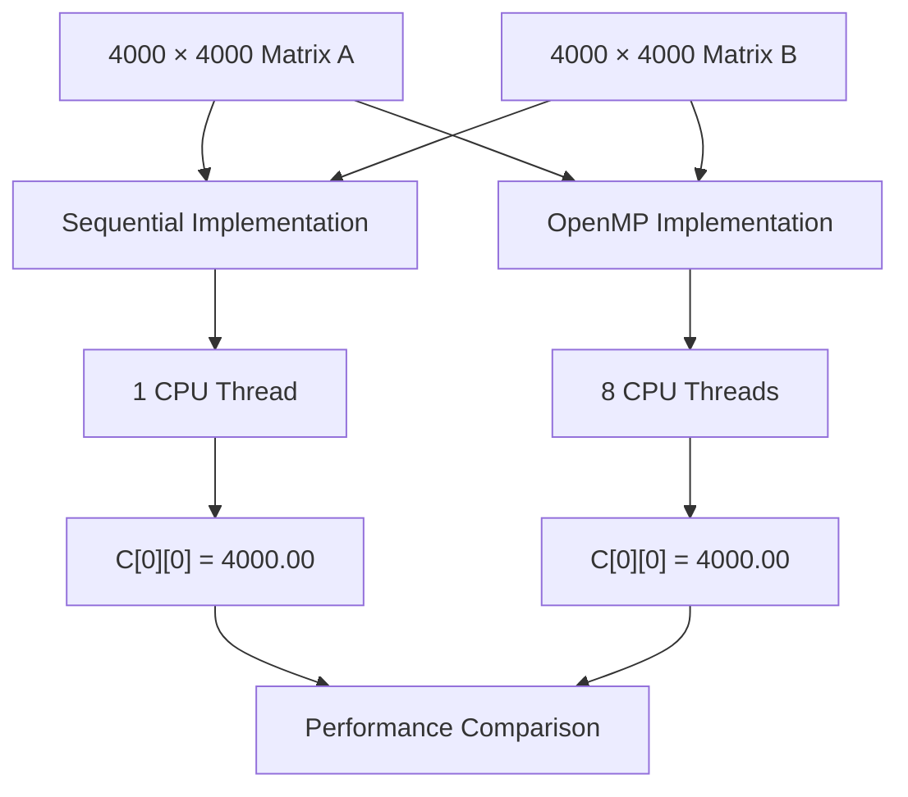
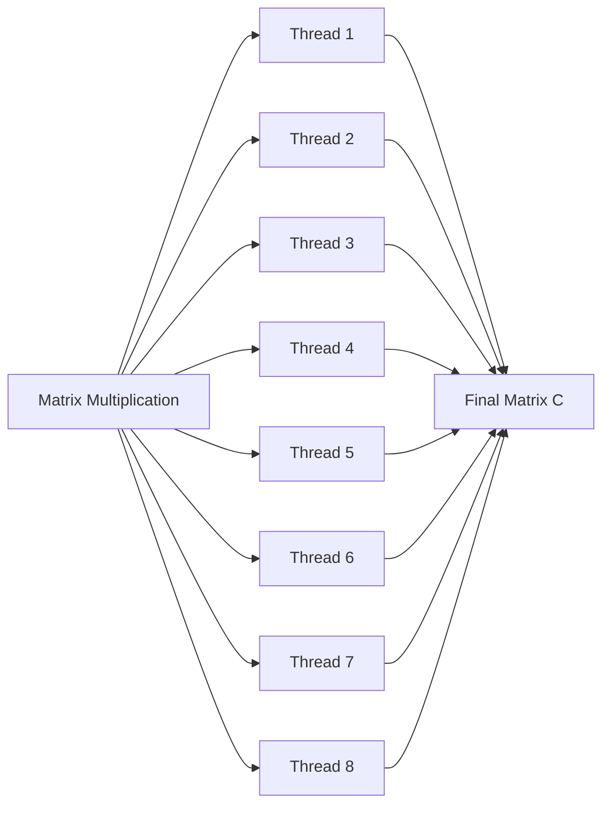
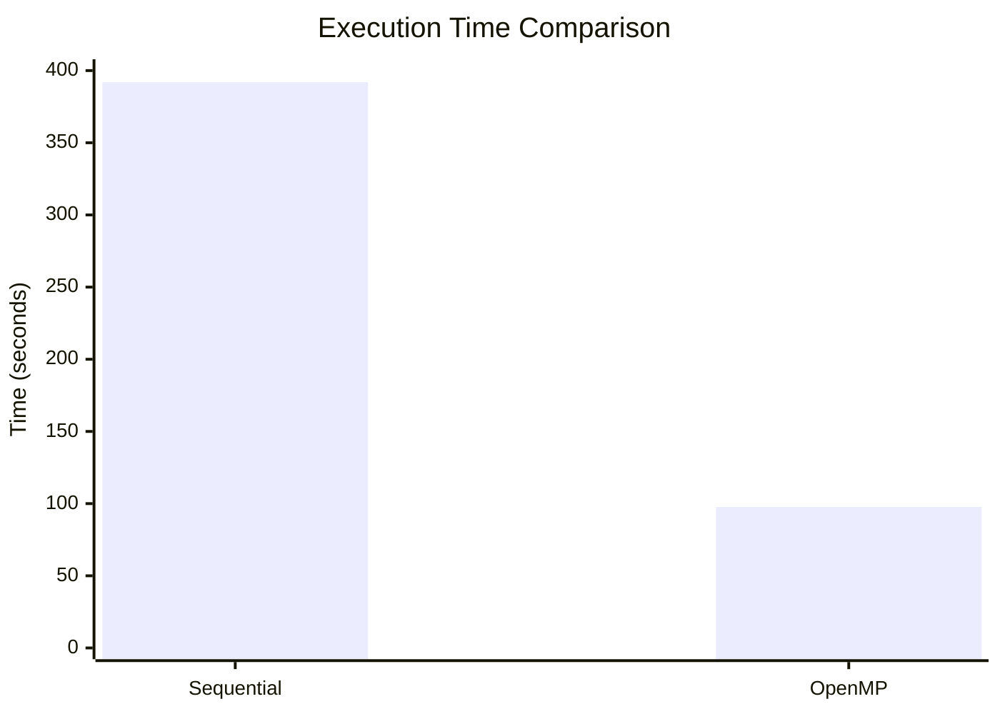

# 🚀 OpenMP Matrix Multiplication — Parallel Computing

This repository demonstrates the implementation and performance evaluation of **matrix multiplication** using **Sequential CPU execution** and **OpenMP parallel processing**.

The experiment uses **4000×4000 matrices** and compares the execution time, speedup, and parallel efficiency between the sequential baseline and an 8-thread OpenMP implementation.

---

## 📊 Highlight Result

> **OpenMP reduced the execution time from 391.98 seconds to 97.72 seconds, achieving a 4.011× speedup with 8 CPU threads while producing the correct result `C[0][0] = 4000.00`.**

| Implementation |   Execution Time |    Speedup | Threads |
| -------------- | ---------------: | ---------: | ------: |
| Sequential     | **391.980118 s** |  **1.00×** |       1 |
| OpenMP         |  **97.720623 s** | **4.011×** |       8 |

**Runtime Reduction:** 75.1%
**Parallel Efficiency:** 50.1%

---

## 📑 Table of Contents

1. [Project Overview](#1-project-overview)
2. [Objectives](#2-objectives)
3. [Architecture Overview](#3-architecture-overview)
4. [Workload Description](#4-workload-description)
5. [Repository Structure](#5-repository-structure)
6. [Sequential Implementation](#6-sequential-implementation)
7. [OpenMP Implementation](#7-openmp-implementation)
8. [How to Compile and Run](#8-how-to-compile-and-run)
9. [Experimental Results](#9-experimental-results)
10. [Performance Analysis](#10-performance-analysis)
11. [Performance Metrics](#11-performance-metrics)
12. [Conclusion](#12-conclusion)

---

# 1. Project Overview

Matrix multiplication is a computationally intensive operation commonly used in:

* Machine Learning
* Computer Graphics
* Scientific Computing
* Image Processing
* Numerical Simulation
* Data Analytics

For two matrices:

$$
C = A \times B
$$

each element of matrix `C` is calculated as:

$$
C[i][j] = \sum_{k=0}^{N-1} A[i][k] \times B[k][j]
$$

The traditional sequential implementation performs these operations one after another.

This project introduces **OpenMP** to divide the computation among multiple CPU threads and evaluate the performance improvement.

---

# 2. Objectives

### 🎯 Primary Objectives

1. Implement matrix multiplication using a **sequential CPU approach**.
2. Implement the same computation using **OpenMP**.
3. Execute the workload using **8 CPU threads**.
4. Compare sequential and parallel execution times.
5. Calculate the resulting **speedup**.
6. Calculate **parallel efficiency**.
7. Verify that both implementations produce the same numerical result.
8. Understand the effect of shared-memory parallelism on computational performance.

---

# 3. Architecture Overview



### Computing Models

| Model      | Processing        | Memory Model         |
| ---------- | ----------------- | -------------------- |
| Sequential | Single CPU thread | Shared system memory |
| OpenMP     | 8 CPU threads     | Shared memory        |

---

# 4. Workload Description

The same workload is used for both implementations to ensure a fair comparison.

### Matrix Configuration

| Parameter      | Value         |
| -------------- | ------------- |
| Matrix A       | `4000 × 4000` |
| Matrix B       | `4000 × 4000` |
| Matrix C       | `4000 × 4000` |
| A elements     | `1.0`         |
| B elements     | `1.0`         |
| OpenMP threads | `8`           |
| Data type      | `double`      |
| Operation      | `C = A × B`   |

Since every element of both input matrices is `1.0`:

$$
C[i][j] =
\sum_{k=0}^{3999}(1.0 \times 1.0)
$$

Therefore:

$$
C[i][j] = 4000
$$

### Verification

```text
C[0][0] = 4000.00
```

The same value is obtained from both the sequential and OpenMP implementations.

---

# 5. Repository Structure

```text
openmp-matrix-multiplication/
│
├── baseline/
│   └── src/
│       └── matrix_sequential.c
│
├── optimized/
│   └── src/
│       └── matrix_openmp.c
│
├── advanced/
│   └── ...
│
├── benchmarks/
│   └── ...
│
├── screenshots/
│   ├── sequential_result.png
│   ├── openmp_result.png
│   └── openmp_htop.png
│
├── Makefile
├── README.md
└── ...
```

### Source Files

| Implementation | File                               | Description                           |
| -------------- | ---------------------------------- | ------------------------------------- |
| Sequential     | `baseline/src/matrix_sequential.c` | Single-threaded matrix multiplication |
| OpenMP         | `optimized/src/matrix_openmp.c`    | Multi-threaded matrix multiplication  |
| Advanced       | `advanced/`                        | Optimized/cache-aware implementation  |
| Benchmarks     | `benchmarks/`                      | Performance measurements and analysis |

---

# 6. Sequential Implementation

The sequential implementation uses the conventional **triple-nested loop**:

```c
for (i = 0; i < N; i++) {
    for (j = 0; j < N; j++) {
        for (k = 0; k < N; k++) {
            C[i][j] += A[i][k] * B[k][j];
        }
    }
}
```

### Working

For every element `C[i][j]`:

1. Select a row from matrix `A`.
2. Select a column from matrix `B`.
3. Multiply corresponding elements.
4. Add the products.
5. Store the result in `C[i][j]`.

### Complexity

Matrix multiplication requires:

$$
O(N^3)
$$

operations.

For `N = 4000`, this represents a very large computational workload, making it suitable for demonstrating parallel processing.

---

# 7. OpenMP Implementation

The OpenMP version parallelizes the outer loop of the matrix multiplication.

Example:

```c
#pragma omp parallel for
for (i = 0; i < N; i++) {
    for (j = 0; j < N; j++) {
        for (k = 0; k < N; k++) {
            C[i][j] += A[i][k] * B[k][j];
        }
    }
}
```

### How OpenMP Works



Instead of processing every row sequentially, OpenMP distributes iterations of the outer loop among multiple CPU threads.

### Key OpenMP Concept

```c
#pragma omp parallel for
```

This directive tells the compiler to:

* Create a parallel region.
* Divide loop iterations among available threads.
* Execute different iterations concurrently.
* Synchronize threads after the loop.

---

# 8. How to Compile and Run

## Prerequisites

The experiment was executed using:

* Ubuntu / WSL
* GCC
* OpenMP
* 16 logical CPU processors
* GCC 13.3.0

---

## Compile Sequential Version

Navigate to the sequential source directory:

```bash
cd baseline/src
```

Compile:

```bash
gcc matrix_sequential.c -o matrix_sequential
```

Run:

```bash
./matrix_sequential
```

---

## Compile OpenMP Version

Navigate to the OpenMP source directory:

```bash
cd optimized/src
```

Compile using the OpenMP flag:

```bash
gcc -fopenmp matrix_openmp.c -o matrix_openmp
```

Run:

```bash
./matrix_openmp
```

---

## Specify Number of Threads

The number of OpenMP threads can be controlled using:

```bash
export OMP_NUM_THREADS=8
```

Then execute:

```bash
./matrix_openmp
```

To verify the number of CPU threads:

```bash
nproc
```

---

# 9. Experimental Results

## 9.1 Sequential Result

The sequential implementation was executed using a single CPU thread.

```text
Matrix Size: 4000 × 4000

Execution Time: 391.980118 seconds

C[0][0] = 4000.00
```

---

## 9.2 OpenMP Result

The OpenMP implementation was executed using 8 CPU threads.

```text
Matrix Size: 4000 × 4000
Threads: 8

Execution Time: 97.720623 seconds

C[0][0] = 4000.00
```

---

## 9.3 Result Verification

Both implementations produced:

```text
C[0][0] = 4000.00
```

This confirms that parallelization did not change the expected computational result.

---

# 10. Performance Analysis

## Performance Comparison

| Metric            |   Sequential |      OpenMP |
| ----------------- | -----------: | ----------: |
| Matrix Size       |    4000×4000 |   4000×4000 |
| Threads           |            1 |           8 |
| Execution Time    | 391.980118 s | 97.720623 s |
| Speedup           |       1.000× |      4.011× |
| Runtime Reduction |            — |       75.1% |
| Efficiency        |            — |       50.1% |
| `C[0][0]`         |      4000.00 |     4000.00 |

---

## Execution Time



The OpenMP implementation substantially reduces the execution time by distributing the workload among multiple CPU threads.

---

## Speedup

The measured speedup is:

$$
Speedup =
\frac{T_{Sequential}}
{T_{OpenMP}}
$$

Substituting the measured values:

$$
Speedup =
\frac{391.980118}
{97.720623}
$$

$$
\boxed{Speedup \approx 4.011\times}
$$

---

# 11. Performance Metrics

## 11.1 Speedup

Speedup measures how many times faster the parallel implementation is compared with the sequential implementation.

$$
S =
\frac{T_s}{T_p}
$$

Where:

* `Ts` = Sequential execution time
* `Tp` = Parallel execution time

For this experiment:

```text
Speedup = 4.011×
```

---

## 11.2 Runtime Reduction

Runtime reduction:

$$
Reduction =
\frac{T_s-T_p}{T_s}\times100
$$

Result:

```text
Runtime Reduction = 75.1%
```

Therefore, OpenMP reduced the execution time by approximately **75.1%** compared with the sequential implementation.

---

## 11.3 Parallel Efficiency

Parallel efficiency measures how effectively the available processor threads are being utilized.

$$
Efficiency =
\frac{Speedup}{P}\times100
$$

where `P` is the number of threads.

For 8 threads:

$$
Efficiency =
\frac{4.011}{8}\times100
$$

$$
\boxed{Efficiency \approx 50.1\%}
$$

---

# 12. Why OpenMP Improves Performance

The sequential implementation processes the matrix rows one after another.

OpenMP allows independent loop iterations to execute simultaneously.

### Sequential

```text
Thread 1
   ↓
Row 1
   ↓
Row 2
   ↓
Row 3
   ↓
...
   ↓
Row 4000
```

### OpenMP

```text
        Matrix
          │
 ┌────────┼────────┐
 ↓        ↓        ↓
T1       T2       T3 ... T8
 │        │        │
Rows     Rows     Rows
 │        │        │
 └────────┼────────┘
          ↓
      Matrix C
```

This reduces the total wall-clock execution time.

---

# 13. Factors Affecting Performance

The measured speedup is lower than the theoretical maximum of 8× with 8 threads.

Possible factors include:

### 1. Thread Management Overhead

Creating, scheduling, and synchronizing threads introduces overhead.

### 2. Memory Access

Matrix multiplication involves a large amount of memory access. CPU performance can therefore be affected by cache and memory bandwidth.

### 3. Synchronization

Threads need synchronization at the end of the parallel loop.

### 4. Hardware Limitations

Actual performance depends on:

* CPU architecture
* Number of physical cores
* Number of logical processors
* Cache size
* Memory bandwidth
* Operating-system scheduling

### 5. Parallelization Overhead

Not every part of a program can be executed simultaneously. The non-parallel portion limits the overall speedup.

---

# 14. Key Concepts Demonstrated

This project demonstrates several important concepts in parallel computing:

* ✅ Sequential computation
* ✅ Shared-memory parallelism
* ✅ OpenMP
* ✅ CPU multithreading
* ✅ Loop parallelization
* ✅ Thread scheduling
* ✅ Matrix multiplication
* ✅ Speedup calculation
* ✅ Parallel efficiency
* ✅ Performance benchmarking
* ✅ Correctness verification

---

# 15. Conclusion

This experiment demonstrates how **OpenMP shared-memory parallelism** can significantly improve the execution time of computationally intensive matrix multiplication.

For the `4000 × 4000` workload:

```text
Sequential : 391.980118 s
OpenMP     : 97.720623 s
Speedup    : 4.011×
Reduction  : 75.1%
Efficiency  : 50.1%
```

Both implementations produced the expected result:

```text
C[0][0] = 4000.00
```

The experiment therefore demonstrates that OpenMP can effectively utilize multiple CPU threads to accelerate computationally intensive workloads while maintaining the correctness of the result.

---

## 🛠️ Technologies Used

* **C**
* **OpenMP**
* **GCC 13.3.0**
* **Ubuntu / WSL**
* **Make**
* **Git & GitHub**

---

## 👨‍💻 Project

**Parallel Computing Laboratory — Matrix Multiplication**

Implementation:

```text
Sequential CPU
       ↓
OpenMP Shared Memory
       ↓
Performance Benchmarking
       ↓
Speedup & Efficiency Analysis
```

---

⭐ **If you found this project useful, consider giving the repository a star!**
